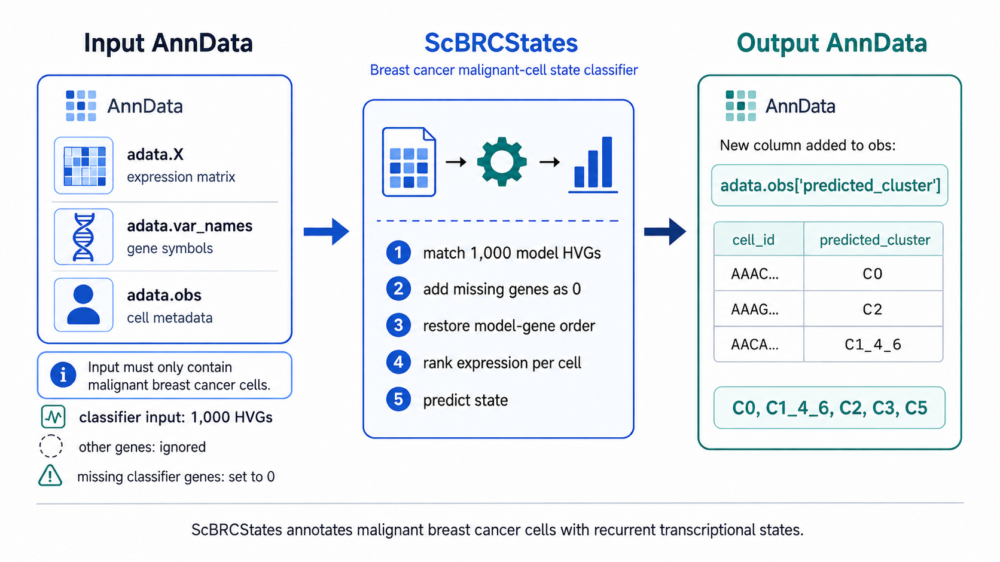

# ScBRCStates

ScBRCStates enables the classification of malignant breast cancer cells in new scRNA-seq datasets using the classifier described by Rott et al.based on 1,000 HVGs.

<p align="center">
  
</p>

The input is an `AnnData` object containing malignant cells. Genes are matched between `adata.var_names` and the 1,000 highly variable genes (HVGs) used by the HistGradient Boosting (HGB) classifier. Genes from the model that are absent from the input dataset are assigned an expression value of 0 before applying the same rank transformation used during classifier development.

ScBRCStates assigns each malignant cell to one of five transcriptional states:

| Cluster | State |
|---|---|
| `C0` | Baseline |
| `C1_4_6` | Stress |
| `C2` | EMT |
| `C3` | Proliferative |
| `C5` | Trogocytosis-like |

## Installation

To avoid dependency conflicts, we recommend installing ScBRCStates in a dedicated environment.

Using Conda:

```bash
conda create -n scbrcstates python=3.11.7
conda activate scbrcstates
```

Clone the repository:

```
git clone https://github.com/que-ro/ScBRCStates.git
cd ScBRCStates
```

Then install it from the repository root:

```bash
pip install .
```

For development/testing:

```bash
pip install -e ".[test]"
```

ScBRCStates was developed and tested with:

* Python 3.11.7
* anndata 0.10.8
* joblib 1.3.2
* numpy 1.23.5
* scipy 1.11.4
* scikit-learn 1.3.2

## Python usage

```python
import anndata as ad
from scbrcstates import annotate

adata = ad.read_h5ad("malignant_cells.h5ad")
annotate(adata)

print(adata.obs["predicted_cluster"].value_counts())
adata.write_h5ad("malignant_cells_annotated.h5ad")
```

By default the expression matrix is read from `adata.X`. A layer can also be specified:

```python
annotate(adata, layer="log1p")
```

A different output column can be used with:

```python
annotate(adata, key_added="ScBRCStates")
```

## Command line

The same annotation can be run directly on an `.h5ad` file:

```bash
scbrcstates malignant_cells.h5ad malignant_cells_annotated.h5ad
```

Optional arguments:

```bash
scbrcstates input.h5ad output.h5ad --key ScBRCStates
scbrcstates input.h5ad output.h5ad --layer log1p
```

## Citation

If you use ScBRCStates in published work, please cite:

Large-scale single-cell integration in breast cancer reveals recurrent malignant cell states, tractable biomarkers and a rare population suggestive of trogocytosis

Quentin ROTT, Guillaume DESANDRE, Celia SEQUERA HURTADO, Christophe GINESTIER, Emmanuelle CHARAFE-JAUFFRET, Jean-Paul Borg, Flavio MAINA, Laurence CHOULIER*, Odile LECOMPTE*

(Submission in progress for Jounral and DOI)

## License

ScBRCStates is distributed under the MIT License.

## Input

ScBRCStates is intended for malignant breast cancer cells. It does not identify malignant cells itself.

`adata.var_names` must contain unique gene names. Genes that are not part of the classifier are ignored. Classifier genes absent from the input dataset are kept at 0 before ranking.

The expression matrix should correspond to the same type of expression values used during classifier development. Scaled or centered expression matrices should not be used.

The prediction preprocessing is :

1. keep model genes present in the dataset;
2. add absent model genes with expression 0;
3. restore the original model-gene order;
4. calculate cell-wise ranks with `np.argsort(np.argsort(...))`;
5. normalize ranks by the maximum rank in each cell;
6. apply the stored HGB classifier and label encoder.

## Tests

Run:

```bash
python -m pytest
```

The tests check that the packaged preprocessing reproduces the original prediction code, including reordered genes and missing genes, and that predictions are correctly added to `adata.obs`.
